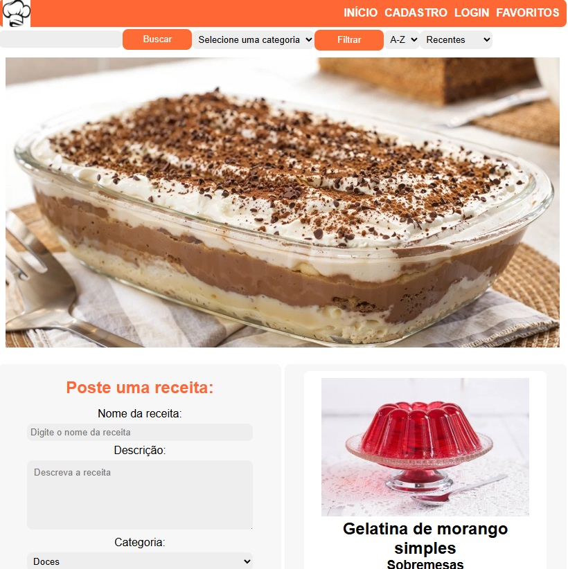
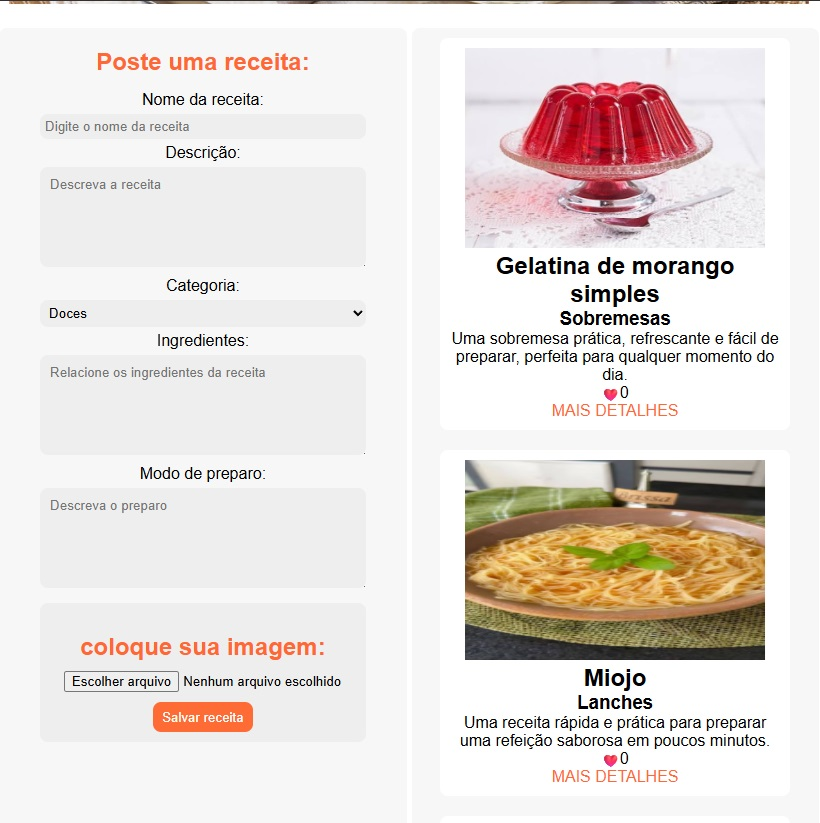
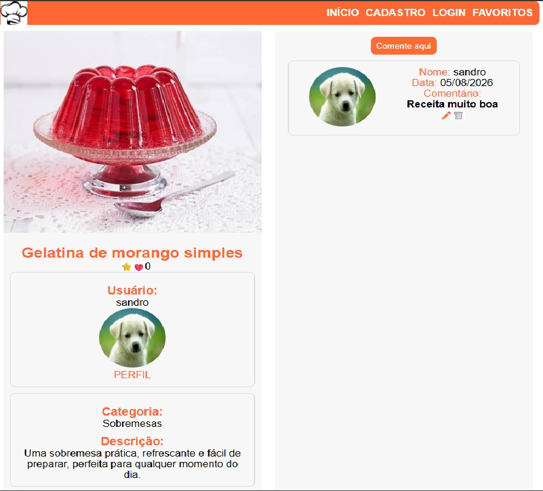
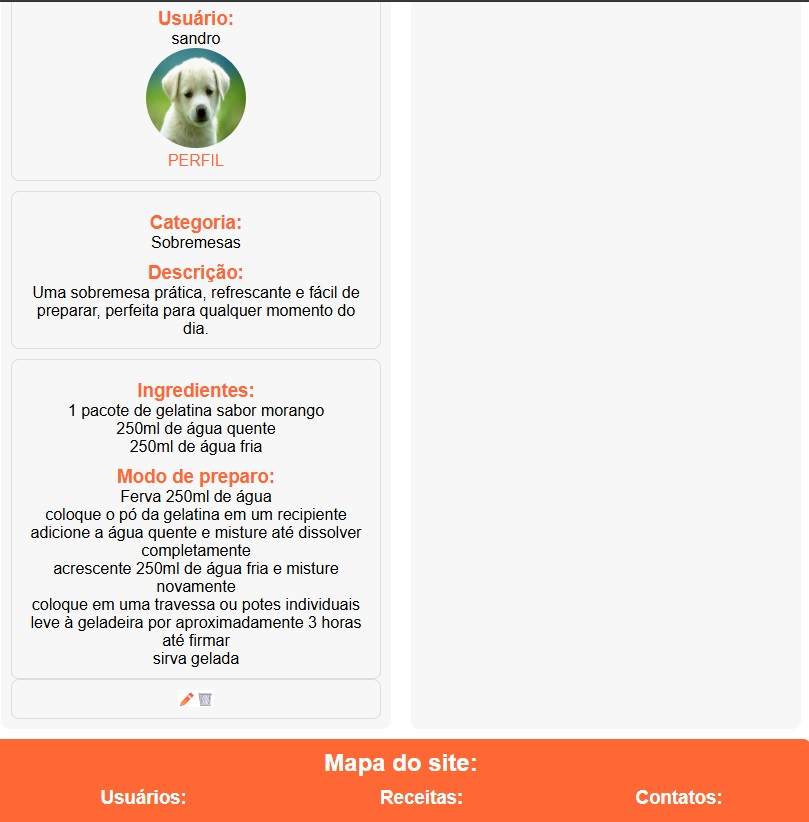
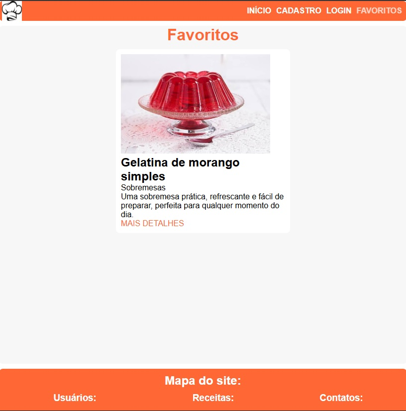
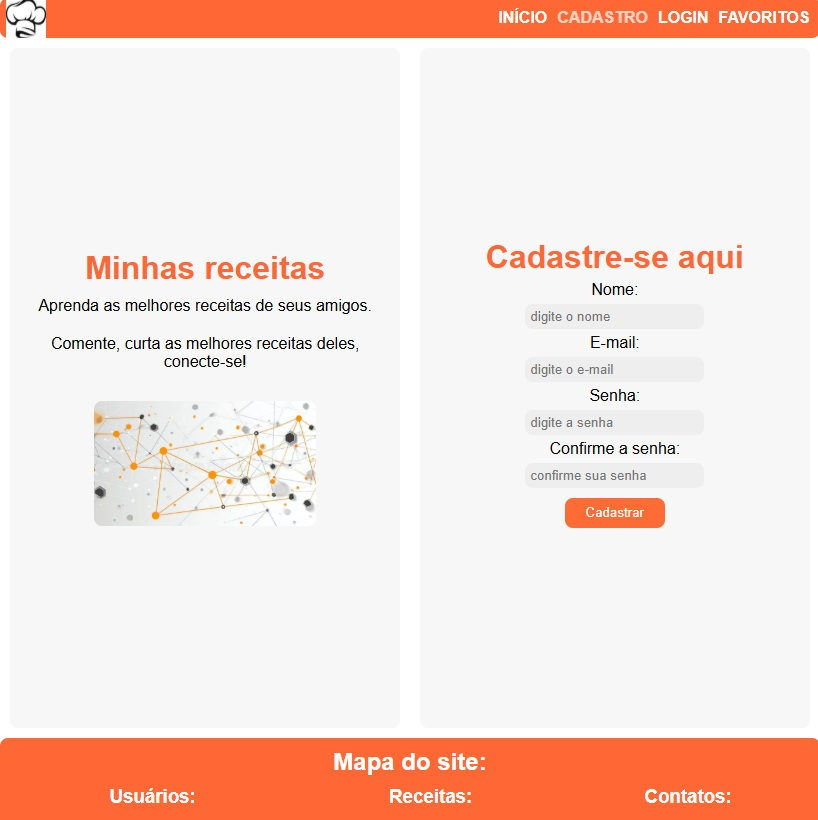
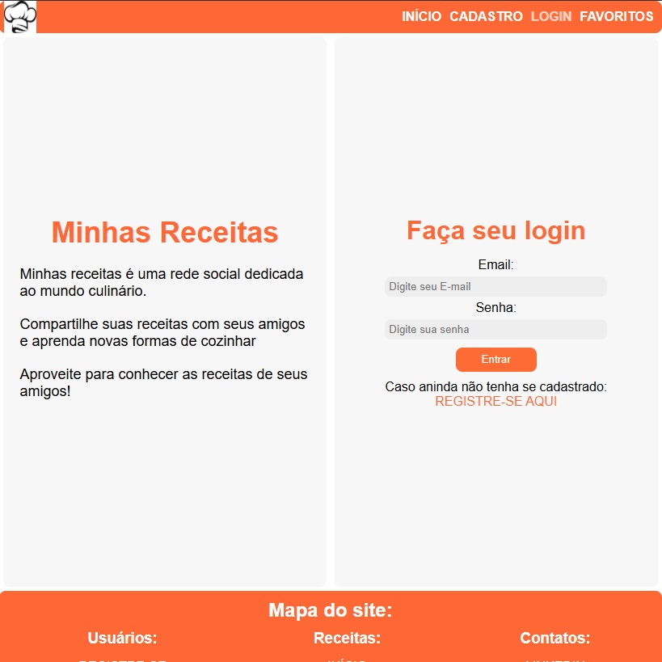
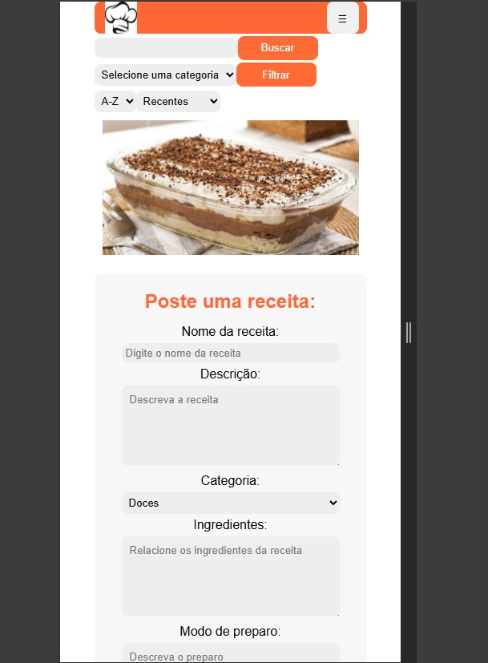

# 🍽️ MinhasReceitas
Aplicação Full Stack , rede social voltada ao tema culinário, desenvolvida com React, Node.js, Express e MongoDB. O sistema permite criar, editar, excluir, pesquisar, filtrar e organizar receitas, além de interações sociais como curtir, comentar e adicionar receitas aos favoritos , demonstrando conhecimentos em desenvolvimento Full Stack e consumo de APIs REST além de tecnologias de autenticação como JWT e bcrypt.

#Descrição

Sistema de gerenciamento de receitas, com autenticação de usuários que também permite interações sociais como curtir e comentar para demonstrar conhecimentos em desenvolvimento Full Stack.

✨ Funcionalidades
✅ Cadastrar novo usuário
✅ Fazer Login
✅ Adicionar foto de perfil
✅ Criar receita com foto
✅ Alterar e deletar receitas 
✅ Curtir, comentar e adicionar em favoritos a receita
✅ Ordenar receitas
✅ Busca por titulo 
✅ Interface responsiva
🛠 Tecnologias
Frontend
React
CSS3
Fetch API
Backend
Node.js
Express
Mongoose
JWT
bcrypt
Multer
Banco de Dados
MongoDB
Ferramentas
Git
GitHub
Vercel
Railway
📸 Capturas de tela

Home
Home

📂 Estrutura do projeto

MinhasReceitas
│
├── backend
│ │
│ ├── src
│ │ │
│ │ ├── config
│ │ ├── controllers
│ │ ├── models
│ │ ├── routes
│ │ ├── middlewares
│ │ └── uploads
│ │
│ ├── package.json
│ ├── server.js
│ └── .env
│
├── frontend
│ │
│ ├── src
│ │ │
│ │ ├── components
│ │ ├── pages
│ │ ├── services
│ │ ├── hooks
│ │ ├── contexts
│ │ └── App.js
│ │
│ ├── package.json
│ └── .env
│
└── README.md

🚀 Como executar

## ⚙️ Como Executar o Projeto

Frontend

Abra outro terminal e acesse a pasta do frontend:

cd frontend

Instale as dependências:

npm install

Inicie a aplicação:

npm start

Após iniciar os dois serviços:

Backend:

http://localhost:5000

Frontend:

http://localhost:3000

🌐 Deploy
Frontend: https://minhas-receitas-rouge.vercel.app/

Backend: https://minhasreceitas-production-67b9.up.railway.app/

youtube: https://www.youtube.com/watch?v=VJiAbwRS5ys

📚 Aprendizados

Desenvolvimento de uma aplicação Full Stack completa. Criação de APIs REST utilizando Node.js e Express. Integração entre frontend e backend através de requisições HTTP. Persistência de dados utilizando MongoDB e Mongoose. Implementação de autenticação de usuários com JWT. Upload e gerenciamento de imagens utilizando Multer. Desenvolvimento de funcionalidades de interação social, como curtidas, favoritos e comentários. Estruturação de aplicações React com componentes reutilizáveis e Hooks. Gerenciamento de rotas e estados da aplicação. Deploy de aplicações utilizando Vercel e Railway.

👨‍💻 Autor

Sandro da Paixão Coelho

